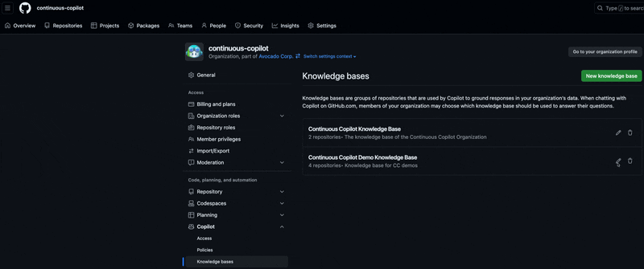
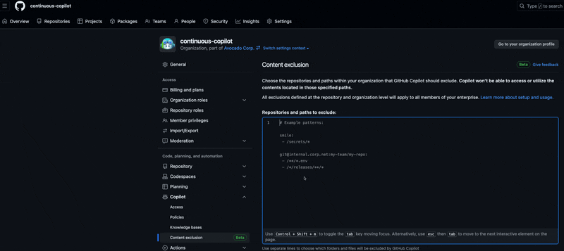

# Copilot Administration & Security - Demo: Policies & Settings

## Overview

This demo will show you how to configure GitHub Copilot for your enterprise and organization. It will guide the customer on each level of configuration and how to enable/disable features.

## GitHub Settings

### Enterprise Settings

#### Enterprise Access Management

Show the following options:

- Total seats assigned and a monthly cost and a link to view billing details
  - **Action Item:** Click link `View billing` and showcase how it looks in your enterprise.
- Copilot Enterprise is active in your enterprise options
  - Disabled
  - Allow for all organizations
  - Allow for specific organizations

#### Enterprise Policies and Features

Show the following options:

- Suggestions matching public code
- Copilot in github.com
  - Give Copilot access to Bing **Beta**
  - Opt in to user feedback collection
- Copilot Chat in the IDE
- Copilot Chat in GitHub Mobile
- Copilot in the CLI

### Organization Settings

#### Manage & Control Access

- Number of copilot seats
- Estimated monthly cost
  - View billing details
- Policy for enabled members
- Access management
  - **Action Item:** Download report and showcase how it looks in your organization.

#### Organization Policies

Show the following options:

- Suggestions matching public code
- Copilot in github.com
  - Give Copilot access to Bing **Beta**
  - Opt in to user feedback collection
- Copilot Chat in the IDE
- Copilot Chat in GitHub Mobile
- Copilot in the CLI

#### Organization Features

##### Knowledge Bases

- Review creating a Knowledge Base
  - Adding a knowledge base path inclusion

##### Content Exclusion

- Review creating a Content Exclusion
  - Adding repository and path to files to exclude

## Client Side Settings

### Network Settings

- Proxy Settings
  - **Action Item:** Show how to configure proxy settings in the IDE
- Authentication Modes
  - **Action Item:** Show how authentication modes work with GitHub Copilot
  
### Firewall Settings

- Show the URLs to add to an allowlist

## IDE Advanced Settings

### Supported IDEs

- Visual Studio Code
- Visual Studio
- IntelliJ IDEA
- Vim/Neovim
- Azure Data Studio

### Enable non-programming Meta Files

- **Action Item:** Show how to enable/disable non-programming meta files in the IDE

### VSCode

GitHub Copilot Extension and click on it -> Click the gear icon -> Click on Extension Settings -> Click on the blue Edit in settings.json button

### IntelliJ IDEA

Go to Settings -> Language and Framework -> GitHub Copilot -> Update advanced settings in this view
