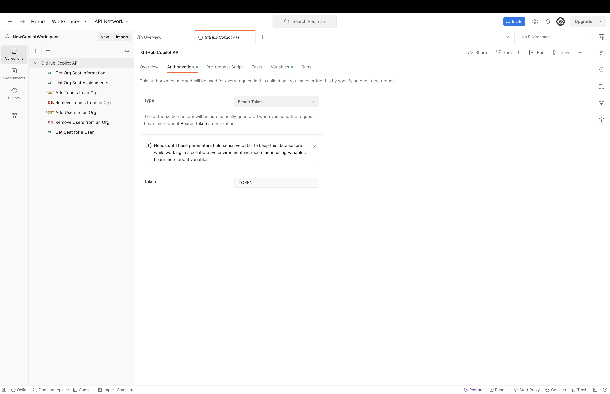
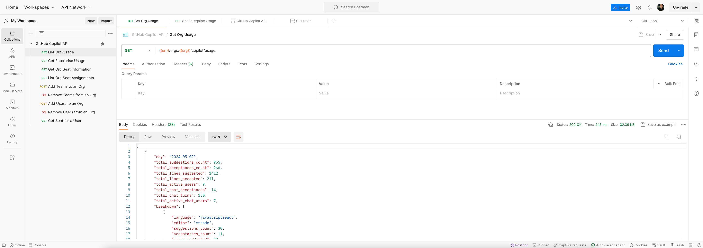
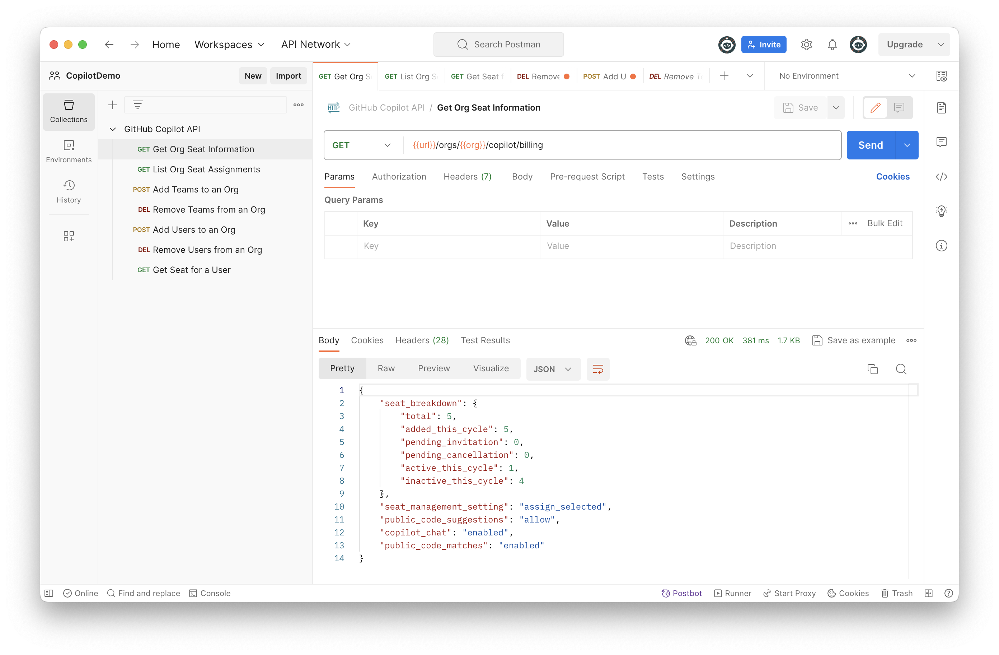
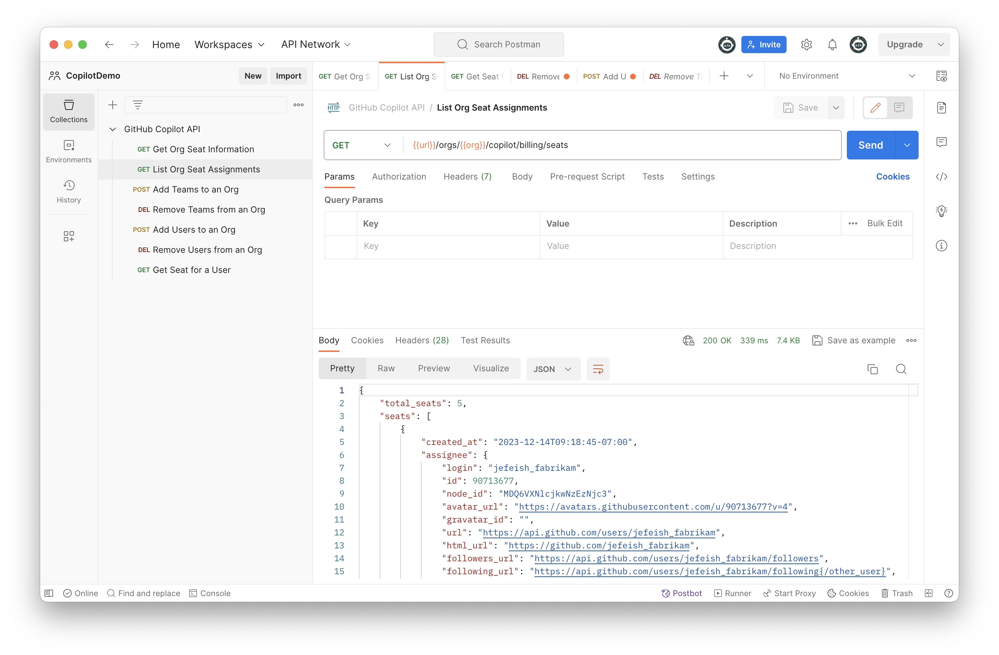
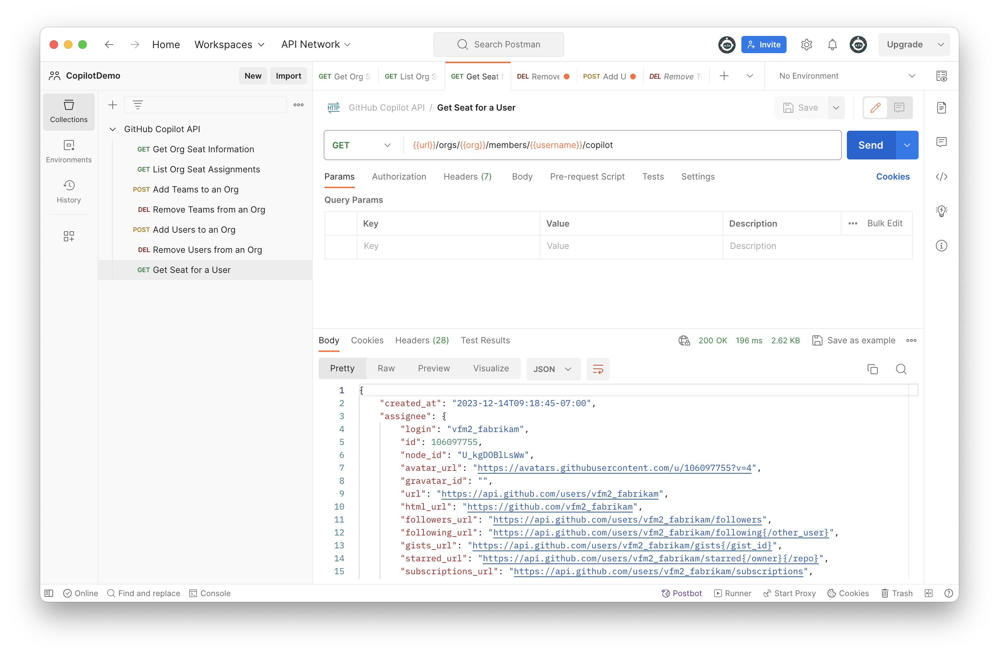

# GitHub Copilot REST API Demo

## Overview

This demo will show how to use the Copilot REST API to get information about your organization. This will guide you through how to get information about your organization, list the seats assigned to your organization, and get the seat information for a specific user.

## Prerequisites

- [ ] [Postman Downloaded and Installed](https://www.postman.com/downloads/)
- [ ] [GitHub Copilot API Collection Downloaded](../Demo2-Telemetry/postman-setup-info/GitHubCopilotAPI.postman_collection.json)
- [ ] [Postman Collection Setup](../Demo2-Telemetry/postman-setup-info/postman-collection-setup.md)

## Demo Steps

### Step 1: Configure variables in Postman

Update "TOKEN" under the Authentication tab with the token you created in the [Create a Token in GitHub](../Demo2-Telemetry/postman-setup-info/postman-collection-setup.md#step-3-create-a-token-in-github) section.

Update the variables "ORG" and "USERNAME" under the Variables tab with your organization name and your GitHub username you want to view. "ENTERPRISE" if you want to view usage for an enterprise account.

### Step 2: Demo the Copilot REST API _Get Org Usage Information_

Double click on "Get Org Usage Information" to open the request. Click "Send" to send the request.

### Step 3: Demo the Copilot REST API _Get Org Seat Information_

Double click on "Get Org Seat Information" to open the request. Click "Send" to send the request.

### Step 4: Demo the Copilot REST API _List Org Seat Assignments_

Double click on "List Org Seat Assignments" to open the request. Click "Send" to send the request.

### Step 5: Demo the Copilot REST API _Get Seat for a User_

Double click on "Get Seat for a User" to open the request. Click "Send" to send the request.

