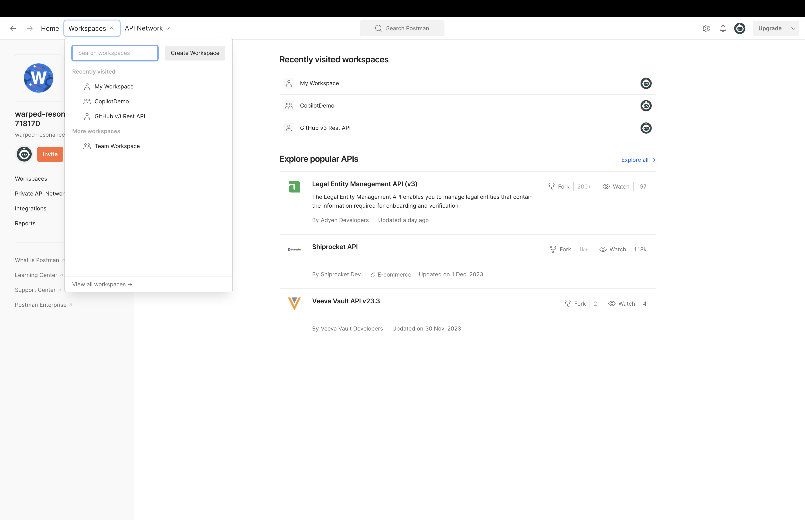
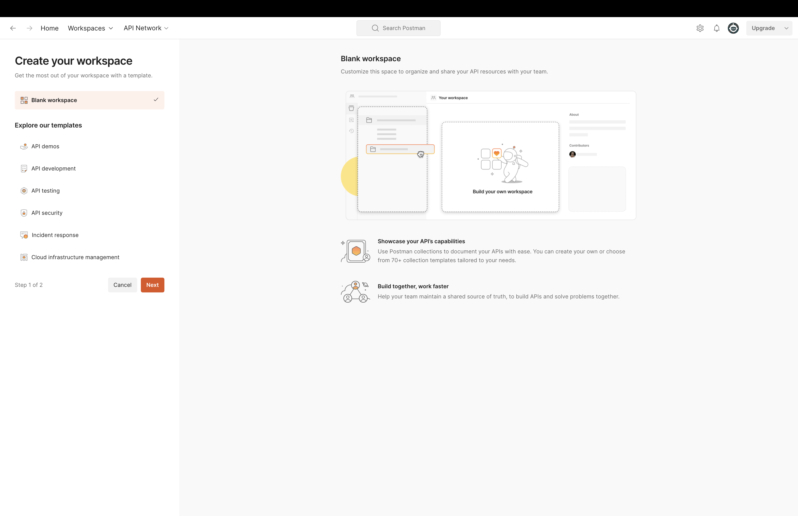
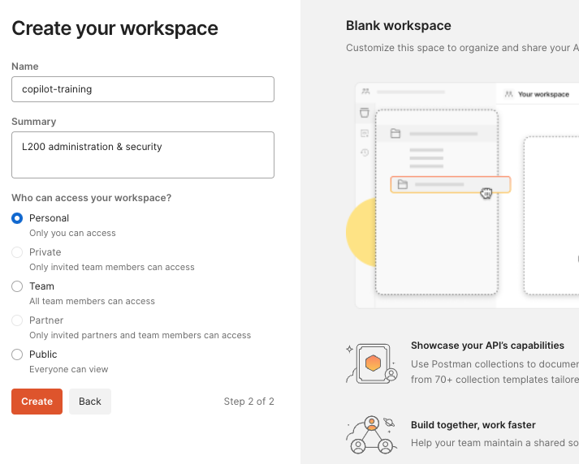
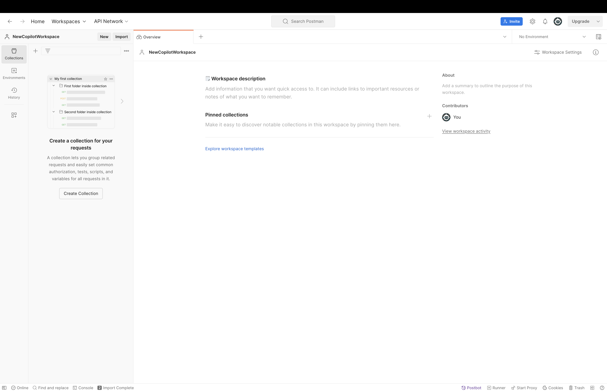
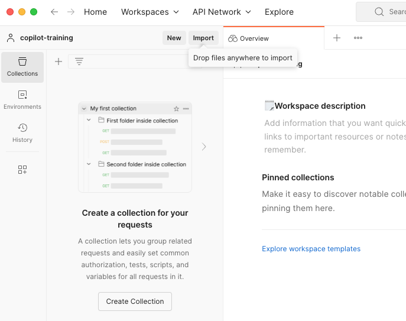
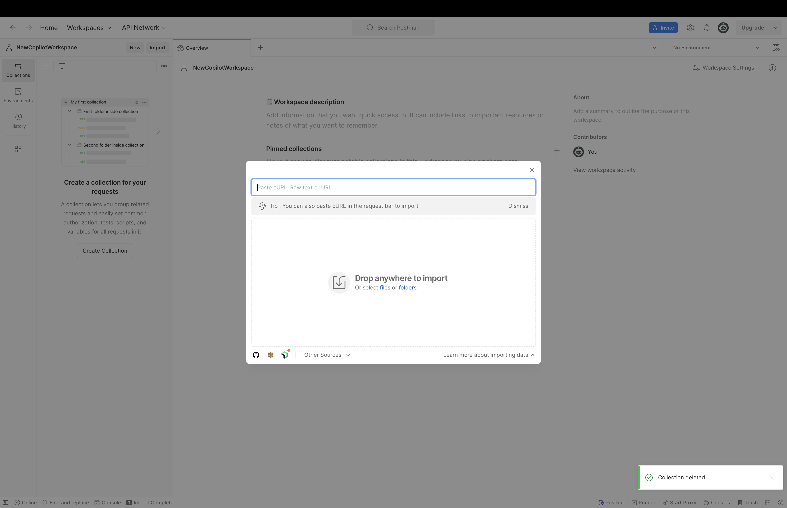
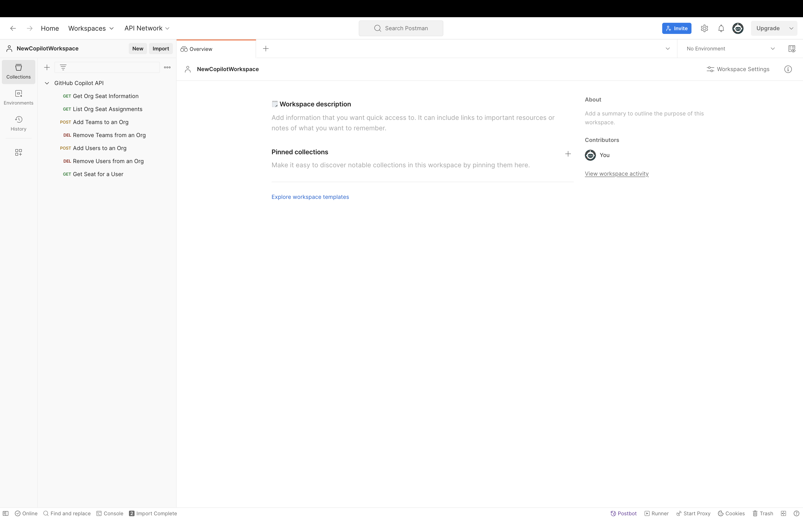
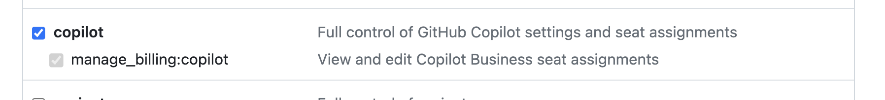

# Setup a Postman Workspace & Collection to Exercise the GitHub Rest API

> NOTE: for the Copilot Administration & Security demo we only focus on the `copilot` REST API calls. These calls only require the ORG name

## Step 1: Create a Postman Workspace

## Step 2: Import a Postman Collection

## Step 3: Create a Token in GitHub

## Step 4: Configure the Collection

> NOTE: Both Postman collections provided are already set to **inherit settings from the parent**. This means setting the Authentication at the collection level will automatically apply to all requests in the collection.

