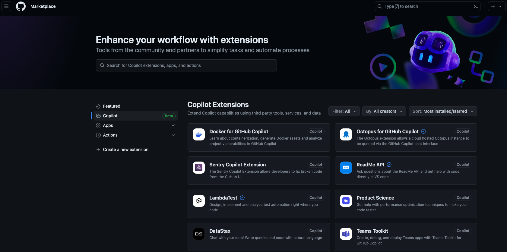
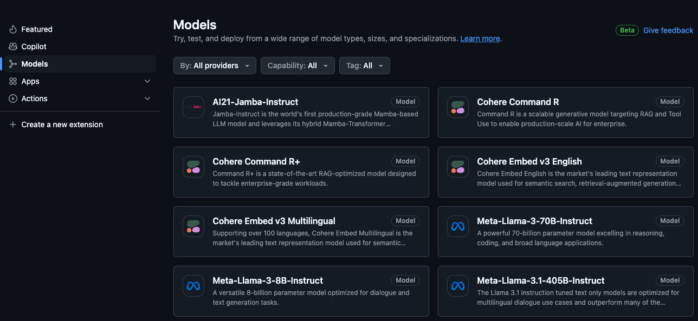

# Integrations

## GitHub Copilot Marketplace Actions

GitHub marketplace actions are a way to automate your workflow. You can use actions to build, test, package, release, and deploy your code right from GitHub. GitHub Copilot provides a set of actions that you can use in your workflow. These actions are available in the GitHub Copilot Marketplace. The following are specific actions that you can be used for Copilot [GitHub Copilot marketplace actions](https://github.com/marketplace?query=copilot)

## GitHub Copilot Usage Action

[GitHub Copilot Usage Action](https://github.com/marketplace/actions/copilot-usage-action) is a GitHub action that allows you to get the usage information of GitHub Copilot for your organization. More details about the action can be found [copilot-usage-action](copilot-usage-action.md)

## GitHub Copilot User and License Management

[GitHub Copilot User and License Management](https://github.com/marketplace/actions/copilot-license-management) is a GitHub action that allows you to manage the users and licenses of GitHub Copilot for your organization. More details about the action can be found [copilot-license-management](copilot-license-management.md)

## GitHub Copilot Extensions

Introducing GitHub Copilot Extensions: Unlocking unlimited possibilities with our ecosystem of partners

Through a growing partner ecosystem, Copilot Extensions enables developers to build and deploy to the cloud in their natural language with their preferred tools and services, all without leaving the IDE or GitHub.com. With Copilot and now Copilot Extensions, developers can stay in the flow longer, uplevel their skills, and innovate faster.

We’re starting with GitHub Copilot Extensions from DataStax, Docker, LambdaTest, LaunchDarkly, McKinsey & Company, Microsoft Azure and Teams, MongoDB, Octopus Deploy, Pangea, Pinecone, Product Science, ReadMe, Sentry, and Stripe. Extensions are supported in GitHub Copilot Chat on GitHub.com, Visual Studio, as well as VS Code.
While the GitHub Marketplace will offer extensions that are open to all, organizations can also create private Copilot Extensions for their homegrown developer tooling, making the capabilities from an internal library of APIs or the knowledge from a custom monitoring system only a conversation away.
How it works: GitHub Copilot Extensions in action
Imagine you’re a developer who just got paged on an incident for a database-related error. You’re trying to get context of the issue from a variety of tools. It could be from a GitHub issue or audit logs in DataStax.
With enough context, you start troubleshooting what could be the cause, going to tools like Sentry for error monitoring to learn more. Then, you have to figure out a solution, apply the fix, and then deploy with Azure. In this scenario, there is a lot of context-switching.
Copilot Extensions bring this whole process together. From GitHub Copilot Chat, you can now easily invoke all of these tools to get context, perform actions, and generate files and pull requests—accelerating workflows across more tools.

## GitHub Copilot Models

With GitHub Models, you build your understanding of AI model capabilities by experimenting with model settings and sending prompts through a chat interface. Additionally, you can directly interact with models through an SDK. Refer to a model's "Getting Started" tab for more information about how to use the SDK.
Refer to a model’s "README" tab for more information on the model. Remember when interacting with a model you are experimenting with AI, so content mistakes are possible.

GitHub Models is designed to allow for learning, experimentation and proof-of-concept activities. The feature is subject to various limits (including requests per minute, requests per day, tokens per request, and concurrent requests) and is not designed for production use cases.
GitHub Models employs a number of [content filters](https://azure.microsoft.com/en-us/products/ai-services/ai-content-safety). These filters cannot be turned off as part of the GitHub Models experience.
If you decide to employ models through [Azure AI](https://ai.azure.com/github/model/docs) or a paid service, please configure your content filters to meet your requirements.

### [Prototyping with AI models](https://docs.github.com/en/github-models/prototyping-with-ai-models)

_Find and experiment with AI models for free._

If you want to develop a generative AI application, you can use GitHub Models to find and experiment with AI models for free. Once you are ready to bring your application to production, you can switch to a token from a paid Azure account. See the [Azure AI](https://ai.azure.com/github/model/docs) documentation.

See also "[Responsible use of GitHub Models](https://docs.github.com/en/github-models/responsible-use-of-github-models)."

#### Finding AI models

To find AI models, go to [GitHub Marketplace](https://github.com/marketplace/models), then click  Models in the sidebar.

To view details about a model, click on the model's name.

