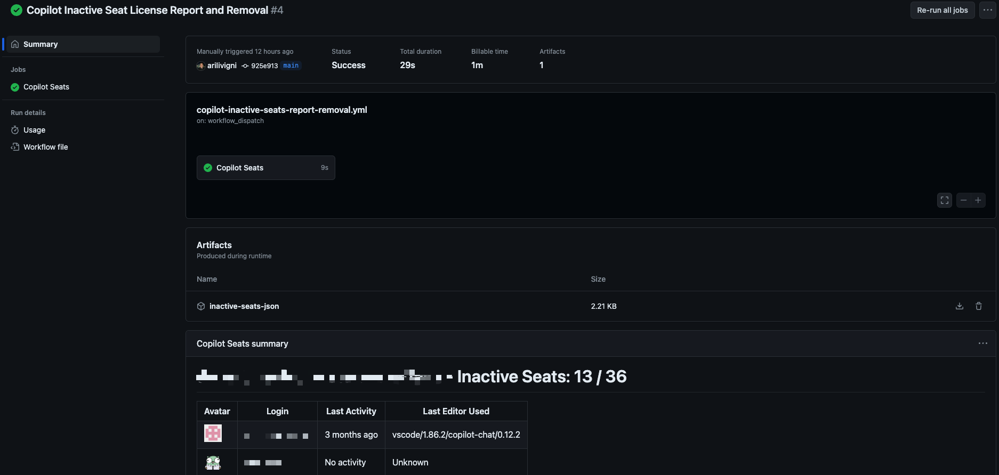

# Copilot License Management

Run this action on a schedule to automatically remove inactive Copilot licenses. It also creates a report as a job summary and csv.
In addition to this it can also deploy users from a CSV file. This is useful as you are adopting Copilot as it can help facilitate the process of adding users to your organization.

## Copilot License Management Usage

Create a workflow (eg: .github/workflows/copilot-license-management.yml). See Creating a Workflow file.

## Deploying users from a CSV file

If you want to deploy users from a CSV file you will need to create a CSV file with the following columns:

- `organization` - The organization to add the user to deployment_group - An arbitrary group name used to track the deployments
- `login` - The user's GitHub Login name to add
- `activation_date` - The date the user should be activated (YYYY-MM-DD)

## PAT (Personal Access Token)

You will need to create a PAT(Personal Access Token) that has manage_billing:copilot access. If you are specifying an 'enterprise' rather than individual organizations you must also include the read:org and read:enterprise scopes.
Add this PAT as a secret TOKEN so we can use it for input github-token, see Creating encrypted secrets for a repository.

## Organizations

If your organization has SAML enabled you must authorize the PAT, see Authorizing a personal access token for use with SAML single sign-on.

## Example Action

```yaml
name: Copilot License Management
on:
  workflow_dispatch:
env:
  COPILOT_ENABLEMENT_TEAM: 'copilot-enablement-users'
  
jobs:
  copilot-inactive-seats:
    name: Copilot Seats
    runs-on: ubuntu-latest
    steps:
      - uses: austenstone/copilot-license-cleanup@v1.4
        id: copilot
        with:
          github-token: ${{ secrets.<PAT> }}
          inactive-days: 40

      - name: Save inactive seats JSON to a file
        run: |
          echo '${{ steps.copilot.outputs.inactive-seats }}' | jq . > inactive-seats.json

      - name: Get logins
        id: getLogins
        env:
          GH_TOKEN: ${{ secrets.<PAT> }}
        run: |
          echo "Organization: ${{ github.repository_owner }}"
          echo "Copilot Beta Team Name: ${{ env.COPILOT_ENABLEMENT_TEAM }}"
          COPILOT_BETA_USERS=$( gh api /orgs/${{ github.repository_owner }}/teams/${{ env.COPILOT_ENABLEMENT_TEAM }}/members | jq -r '.[].login' )
          echo "Copilot Beta Users:"
          echo "$COPILOT_BETA_USERS"
          
          INACTIVE_USERS=($( jq -r '.[].assignee.login' inactive-seats.json ))
          echo "Inactive users to be removed from Copilot Beta Users Team:"
          for USER in "${INACTIVE_USERS[@]}"; do
            echo "Login: $USER"
            ## uncomment the next line to remove users from the Copilot Beta Users so the Copilot license is removed
            # gh api /orgs/${{ github.repository_owner }}/teams/${{ env.COPILOT_ENABLEMENT_TEAM }}/memberships/$USER
          done
          
      - name: Upload inactive seats JSON as artifact
        uses: actions/upload-artifact@v4
        with:
          name: inactive-seats-json
          path: inactive-seats.json
```


