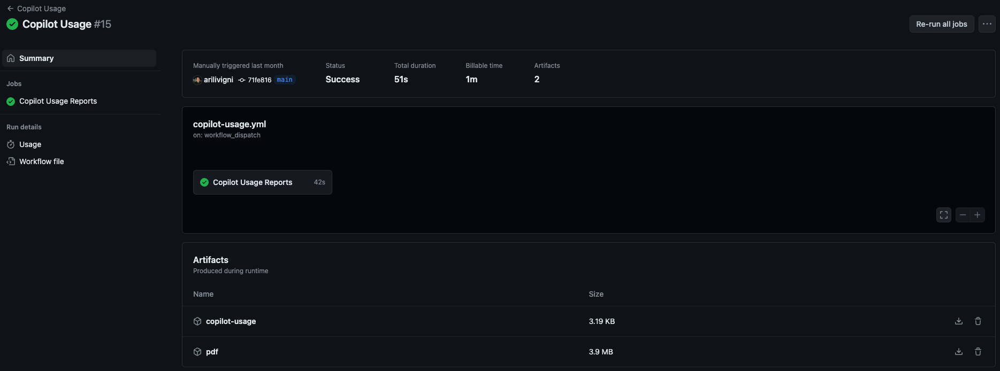
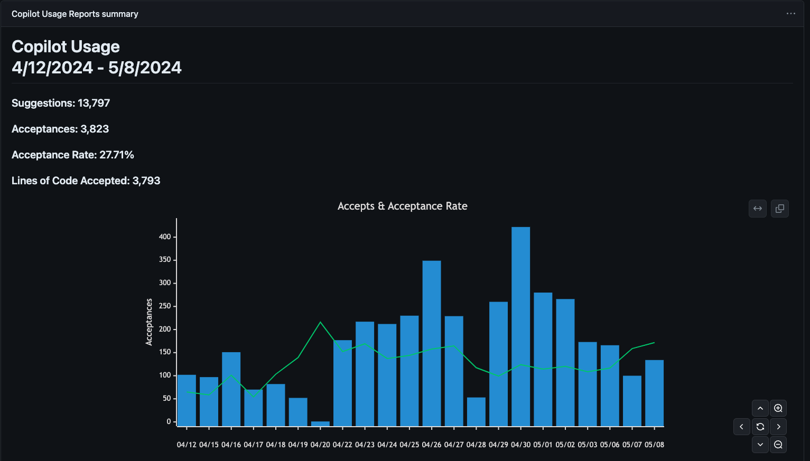

# GitHub Copilot Usage Action

Run this action on a schedule to automatically remove inactive Copilot licenses. It also creates a report as a job summary and csv.
In addition to this it can also deploy users from a CSV file. This is useful as you are adopting Copilot as it can help facilitate the process of adding users to your organization.

## GitHub Copilot Usage Action Usage

Create a workflow (eg: .github/workflows/copilot-license-management.yml). See Creating a Workflow file.

## Deploying users from a CSV file

If you want to deploy users from a CSV file you will need to create a CSV file with the following columns:

- `organization` - The organization to add the user to deployment_group - An arbitrary group name used to track the deployments
- `login` - The user's GitHub Login name to add
- `activation_date` - The date the user should be activated (YYYY-MM-DD)

## PAT (Personal Access Token)

You will need to create a PAT(Personal Access Token) that has manage_billing:copilot access. If you are specifying an 'enterprise' rather than individual organizations you must also include the read:org and read:enterprise scopes.
Add this PAT as a secret TOKEN so we can use it for input github-token, see Creating encrypted secrets for a repository.

## Organizations

If your organization has SAML enabled you must authorize the PAT, see Authorizing a personal access token for use with SAML single sign-on.

## Job Summary Action

[Get Job SUmmary](https://github.com/marketplace/actions/get-job-summary)

### Job Summary Action Usage

```yaml
      - uses: austenstone/job-summary@v2.0
```

## Example Action

```yaml
name: Copilot Usage Report
on:
  workflow_dispatch:

jobs:
  run:
    name: Copilot Usage Reports
    runs-on: ubuntu-latest
    steps:
      - uses: austenstone/copilot-usage@v1.2
        with:
          github-token: ${{ secrets.<PAT> }}
          csv: true
      - uses: austenstone/job-summary@v2.0
        id: copilot-job-summary
        with:
          name: copilot-usage-report
```

### Example Outputs

- [Copilot Usage Report - PDF](copilot-usage-report.pdf)
- [Copilot Usage Report - CSV](copilot-usage-report.csv)


