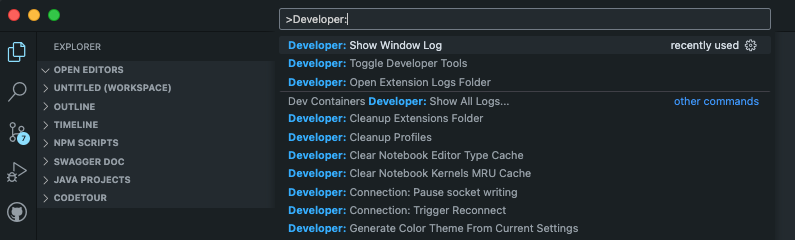

# Visual Studio Code

Information about Logs stored in Standard Locations for Visual Studio Code Extensions

---

## VS Code Application Menu

Review GitHub Copilot extension entries in the standard log file.

- `View` &#8594; `Output`: `Filter: GitHub Copilot`

---

## VS Code Command Palette

VS Code Command Palette commands to investigate issues.

>NOTE: To open the **Command Palette** type `#3` or use the Menu-item, `View` &#8594; `Command Palette`

|Commands| Description|Notes|
|---|---|---|
|`Developer: Open Extension Logs Folder`| opens the external application log folder ||
|`Copilot: Open Logs`| Same as above Application Menu approach ||
|`GitHub Copilot: Copilot Diagnostics`| provides a diagnostic results file ||
|`Preferences: Open User Settings (JSON)` &#8594; `Insert top-level property`|Enable the ***Debug log-level***, if the Log files don't contain enough information to resolve the issue|    <pre> "github.copilot.advanced": {  &nbsp;&nbsp;&nbsp;"debug.overrideLogLevels": { &nbsp;&nbsp;&nbsp;&nbsp; "*": "DEBUG"  &nbsp;&nbsp;&nbsp;&nbsp;} &nbsp;&nbsp; }</pre>|
|`Developer: Toggle Developer Tools`|View Electron Logs (IDE)  In rare cases, errors might not be propagated to the corresponding error handlers and are not logged in the standard logging locations. If you encounter errors with no apparent log entries, consider examining logs emanating from both the process running VS Code and the associated extension.||

---
